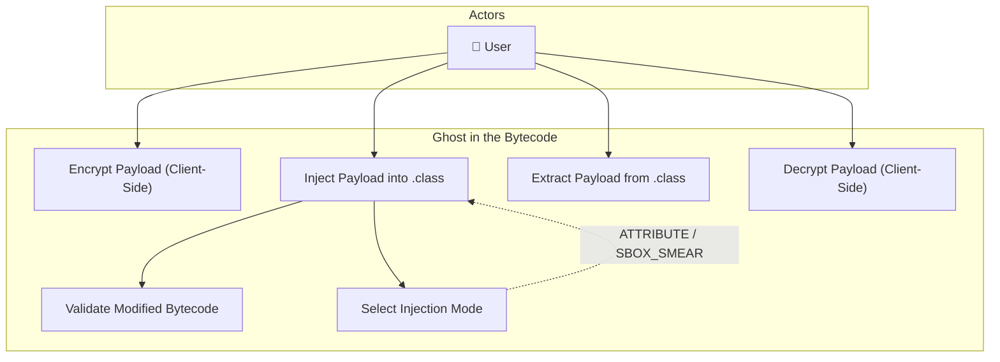
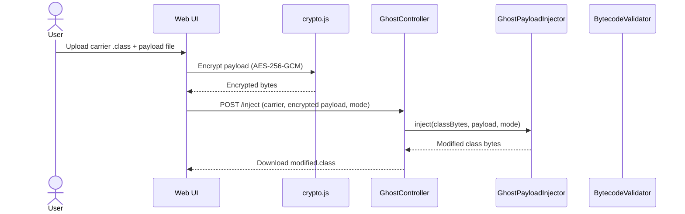
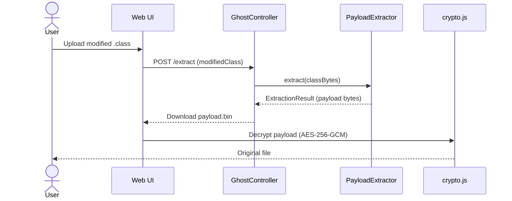
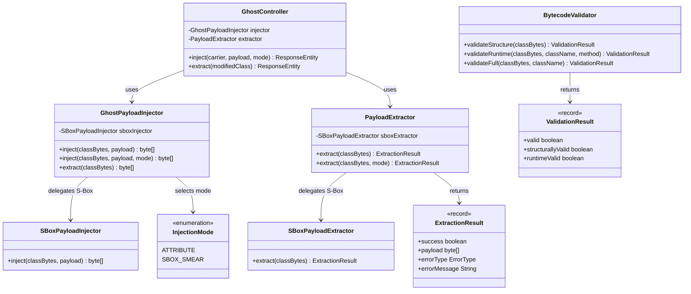

# System Architecture

## Overview
The system consists of a web frontend and a backend service responsible for bytecode manipulation.

---

## Use Case Diagram

---

## Sequence Diagram — Injection Flow

## Sequence Diagram — Extraction Flow

---

## Class Diagram

---

## Components

### 1. Frontend (Web UI)
- File upload/download
- Client-side encryption/decryption
- Key management (user-supplied)

### 2. Injection Service (Backend)
- Reads Java `.class` files
- Injects encrypted payload into class attributes
- Outputs valid `.class` files

### 3. Extraction Service
- Reads modified `.class` files
- Extracts encrypted payload
- Returns payload bytes

### 4. Validation Module
- Ensures modified classes still execute
- Detects corruption or invalid bytecode

## Architectural Principle
All injected data must be **static**, **non-executable**, and **JVM-verifiable**.
