# System Architecture — ByteStego

## Overview
ByteStego is a steganographic framework for embedding encrypted payloads within structurally valid JVM bytecode. The system comprises a web-based frontend for client-side encryption and a modular Java backend for bytecode-level payload embedding, extraction, and validation.

---

## Use Case Diagram

```mermaid
graph TB
    subgraph Actors
        User["👤 User"]
    end

    subgraph "ByteStego System"
        UC1["Encrypt Payload (Client-Side AES-256-GCM)"]
        UC2["Embed Payload into .class File"]
        UC3["Extract Payload from .class File"]
        UC4["Decrypt Payload (Client-Side)"]
        UC5["Validate Modified Bytecode"]
        UC6["Select Embedding Mode"]
    end

    User --> UC1
    User --> UC2
    User --> UC3
    User --> UC4
    UC2 --> UC5
    UC2 --> UC6
    UC6 -.->|"ATTRIBUTE / SBOX_SMEAR"| UC2
```

---

## Sequence Diagram — Embedding Flow

## Sequence Diagram — Extraction Flow

---

## Class Diagram

---

## Components

| Module | Responsibility |
|--------|---------------|
| **Web UI** | File upload/download, client-side AES-256-GCM encryption/decryption |
| **Embedder** | Bytecode-level payload embedding via ASM framework |
| **Extractor** | Payload recovery from modified class files |
| **Validator** | Structural and runtime verification of modified bytecode |
| **API** | Spring Boot REST interface bridging UI and backend modules |

## Architectural Constraint
All embedded data must be **static**, **non-executable**, and **JVM-verifiable**.
