# System Architecture — ByteStego

## Overview
ByteStego is a steganographic framework for embedding encrypted payloads within structurally valid JVM bytecode. The system comprises a web-based frontend for client-side encryption and a modular Java backend for bytecode-level payload embedding, extraction, and validation.

---

## Use Case Diagram

```mermaid
graph TB
    subgraph Actors
        User["👤 User"]
    end

    subgraph "ByteStego System"
        UC1["Encrypt Payload (Client-Side AES-256-GCM)"]
        UC2["Embed Payload into .class File"]
        UC3["Extract Payload from .class File"]
        UC4["Decrypt Payload (Client-Side)"]
        UC5["Validate Modified Bytecode"]
        UC6["Select Embedding Mode"]
    end

    User --> UC1
    User --> UC2
    User --> UC3
    User --> UC4
    UC2 --> UC5
    UC2 --> UC6
    UC6 -.->|"ATTRIBUTE / SBOX_SMEAR"| UC2
```



---

## Sequence Diagram — Embedding Flow


## Sequence Diagram — Extraction Flow


---

## Class Diagram


---

## Components

| Module | Responsibility |
|--------|---------------|
| **Web UI** | File upload/download, client-side AES-256-GCM encryption/decryption |
| **Embedder** | Bytecode-level payload embedding via ASM framework |
| **Extractor** | Payload recovery from modified class files |
| **Validator** | Structural and runtime verification of modified bytecode |
| **API** | Spring Boot REST interface bridging UI and backend modules |

---

## Component Diagram — Architecture

This diagram illustrates the high-level module structure and dependencies within the ByteStego system.

```mermaid
componentDiagram
    component "Web Frontend" as UI
    component "REST API" as API
    
    package "ByteStego Backend" {
        component "SteganographyController" as Controller
        component "PayloadEmbedder" as Embedder
        component "PayloadExtractor" as Extractor
        component "BytecodeValidator" as Validator
        component "ASM Library" as ASM
    }

    UI --> API : HTTP/JSON
    API --> Controller : Internal Call
    Controller --> Embedder : Uses
    Controller --> Extractor : Uses
    Embedder --> Validator : Validates Output
    Embedder --> ASM : Manipulates Bytecode
    Extractor --> ASM : Parses Bytecode
    Validator --> ASM : Analyzes Structure
```

---

## State Diagram — Payload Model

This diagram models the lifecycle of a payload as it transitions through the system states.


---

## Algorithm Flowchart — S-Box Embedding Design

This flowchart details the logic for the stealthy "S-Box Smearing" embedding mode.


---

## Architectural Constraint
All embedded data must be **static**, **non-executable**, and **JVM-verifiable**.
