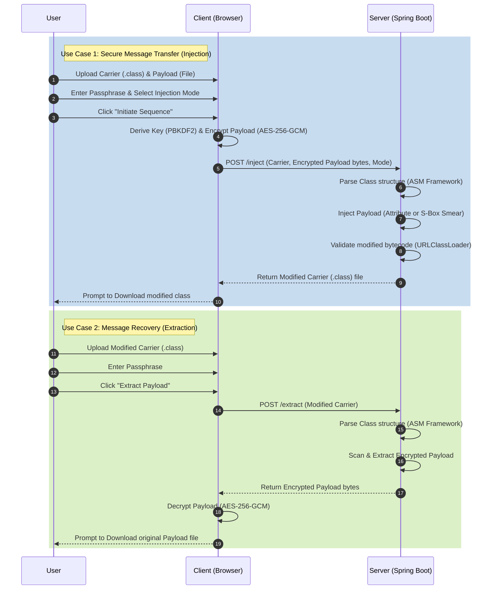
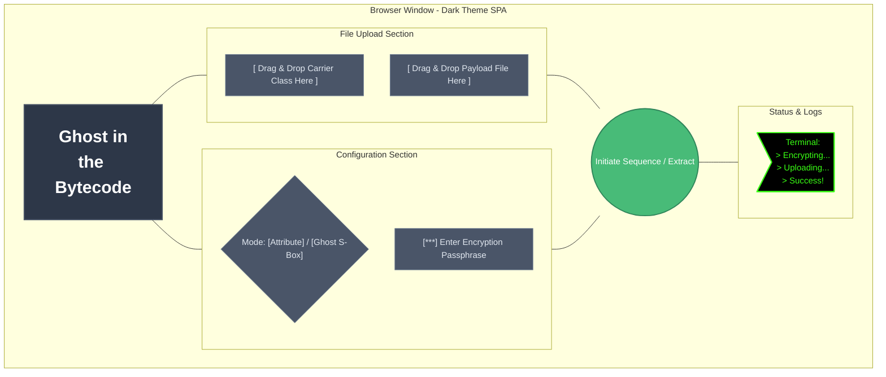

# System Diagrams: Ghost in the Bytecode

This document contains the UML and Mock diagrams for the varying components and flows within the Ghost in the Bytecode system. These diagrams are generated using GitHub's native Mermaid integration.

## 1. Process Flow / Use-Case Diagram

The following sequence diagram outlines the major use cases: **Secure Message Transfer** (Injection) and **Message Recovery** (Extraction). It details the interactions between the User, the Browser (handling encryption), and the Server (handling bytecode manipulation).



## 2. Wireframes / Web UI Mock Diagram

Since Mermaid does not have a dedicated wireframing tool, standard flow node shapes are utilized to demonstrate the layout and structural hierarchy of the Single-Page Application (SPA) Web UI.



## 3. Architecture Diagram

The architecture diagram outlines the system's Client-Server topology, illustrating the boundaries of the Zero-Knowledge principle. The server never processes plaintext, and the client handles all cryptographic operations.

```mermaid
graph LR
    subgraph Client [Client-Side (Browser)]
        UI[Web UI / HTML5 / CSS3]
        Crypto[Web Crypto API]
        UI <-->|AES-GCM / PBKDF2| Crypto
    end

    subgraph Backend [Server-Side (Spring Boot)]
        API[REST Controllers]
        ASM[ASM Bytecode Manipulator]
        JVM[JVM Validation Engine]
        
        API -->|Parse / Build| ASM
        ASM -->|Verify Executability| JVM
    end

    %% Network Boundaries
    UI -- "POST /inject\n(Multipart Data)" --> API
    UI -- "POST /extract\n(Carrier File)" --> API
    
    API -- "Modified Class" --> UI
    API -- "Encrypted Bytes" --> UI

    classDef browser fill:#ebf8ff,stroke:#3182ce,stroke-width:2px;
    classDef server fill:#f0fff4,stroke:#38a169,stroke-width:2px;
    
    class Client browser;
    class Backend server;
```
